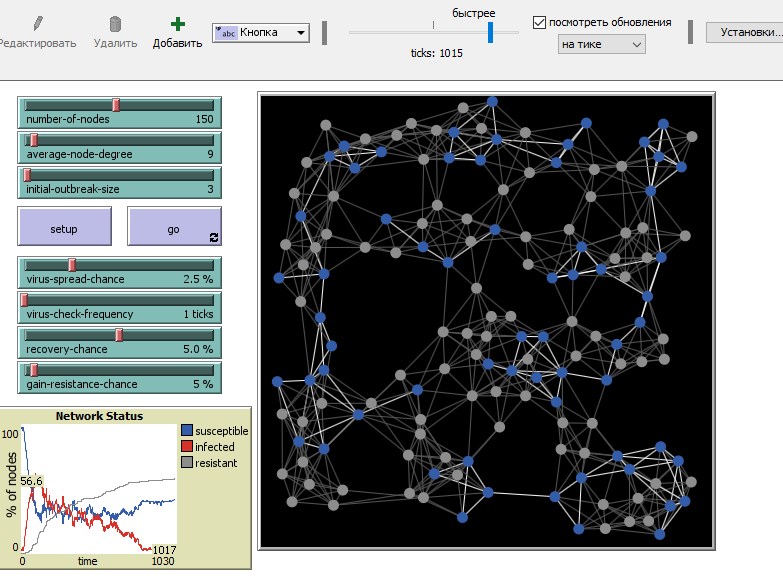
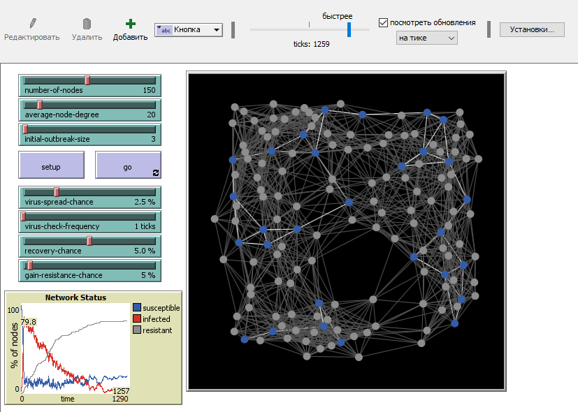
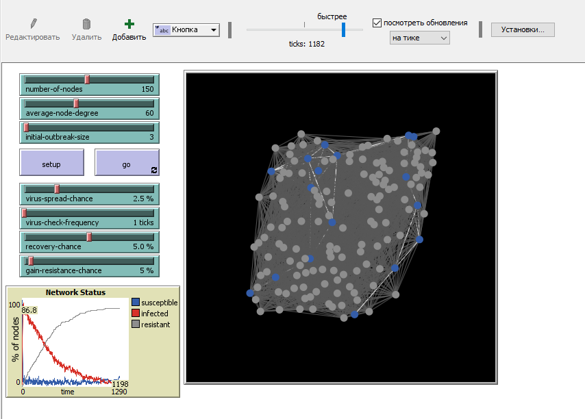
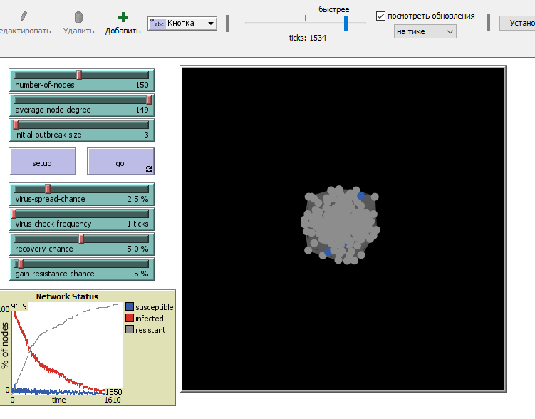
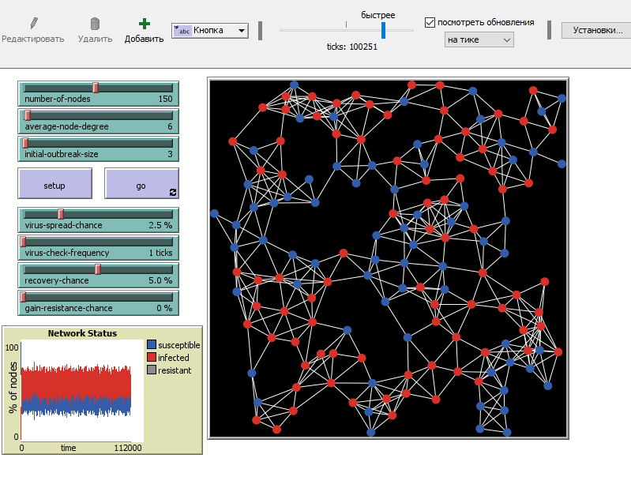
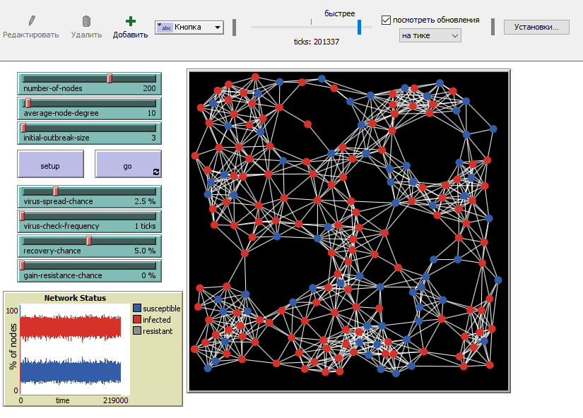
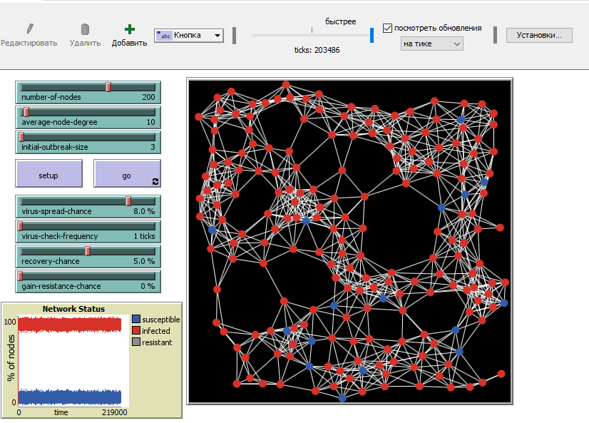
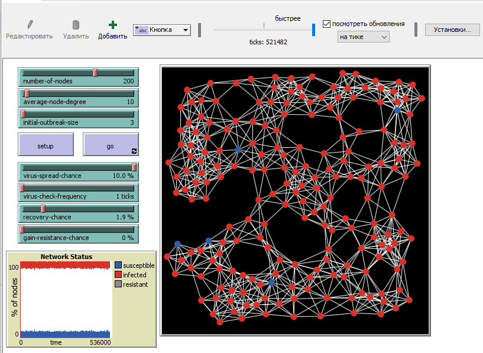
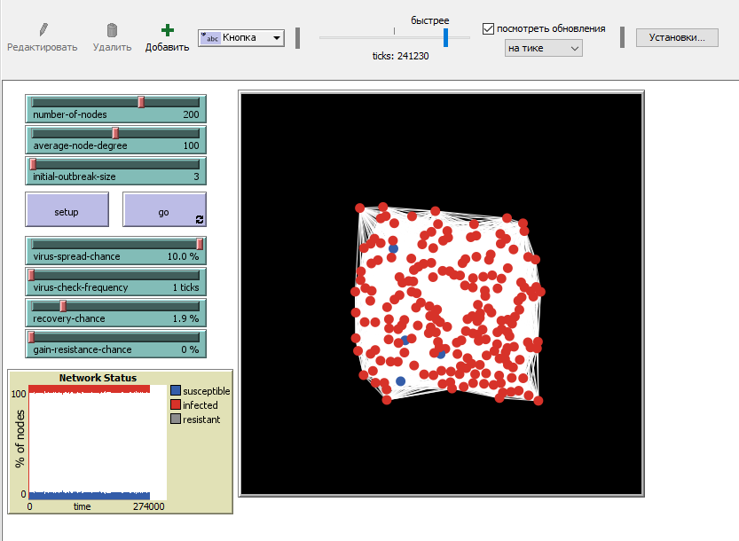
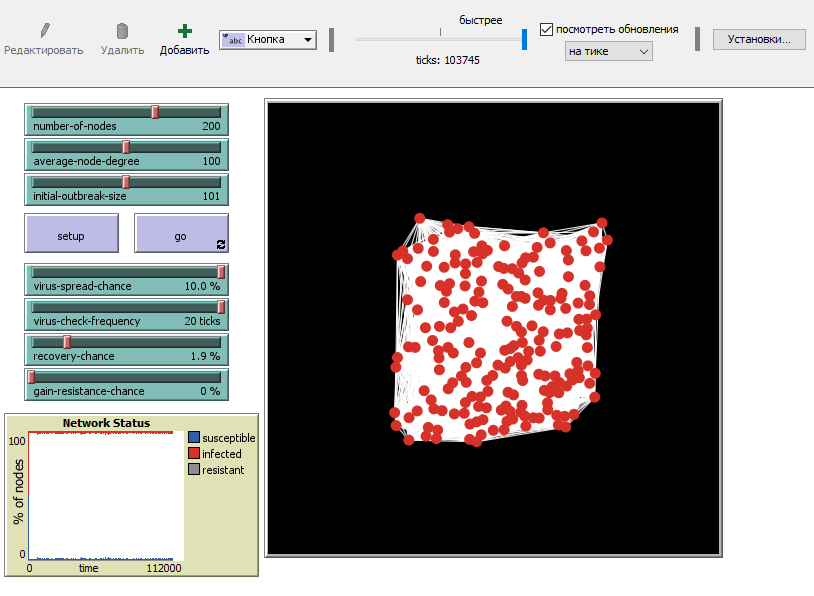

## Імітаційне моделювання комп'ютерних систем
## СПм-21-2, Iльяшов Олександр Андрiйович
### Лабораторна робота №1. Опис імітаційних моделей
 

## Обрана модель в середовищі NetLogo:
[Virus on a Network](http://www.netlogoweb.org/launch#http://www.netlogoweb.org/assets/modelslib/Sample%20Models/Networks/Virus%20on%20a%20Network.nlogo)
 

### Вербальний опис моделі:
Virus on a Network - Ця модель демонструє поширення вірусу через мережу. Хоча модель є дещо абстрактною, одна інтерпретація полягає в тому, що кожен вузол представляє комп’ютер, і ми моделюємо розвиток комп’ютерного вірусу (або хробака) через цю мережу. Кожен вузол може перебувати в одному з трьох станів: чутливий, інфікований або резистентний. У науковій літературі таку модель іноді називають моделлю SIR для епідемій..

На кожному кроці часу кожен інфікований вузол (червоного кольору) намагається заразити всіх своїх сусідів. Сприйнятливі сусіди (позначені синім кольором) будуть заражені з імовірністю, визначеною повзунком VIRUS-SPREAD-CHANCE. Це може відповідати ймовірності того, що хтось у сприйнятливій системі справді виконає заражене вкладення електронної пошти. Стійкі вузли (пофарбовані в сірий колір) не можуть бути інфіковані. Це може відповідати найновішому антивірусному програмному забезпеченню та виправленням безпеки, які роблять комп’ютер несприйнятливим до цього конкретного вірусу.
Заражені вузли не відразу усвідомлюють, що вони заражені. Лише час від часу (визначається повзунком VIRUS-CHECK-FREQUENCY) вузли перевіряють, чи не заражені вони вірусом. Це може відповідати регулярній процедурі сканування на віруси або просто людині, яка помітила щось підозріле в тому, як поводиться комп’ютер. Коли вірус виявлено, існує ймовірність, що вірус буде видалено (визначається повзунком RECOVERY-CHANCE).
Якщо вузол відновлюється, існує певна ймовірність того, що він стане стійким до цього вірусу в майбутньому (задається повзунком GAIN-RESISTANCE-CHANCE).
Коли вузол стає стійким, зв’язки між ним і його сусідами затемнюються, оскільки вони більше не є можливими векторами для поширення вірусу.

## Обчислювальні експерименти

### 1. Яке відношення кількості імунних вузлів до кількості чутливих вузлів? Як на це впливає зміна AVERAGE-NODE-DEGREE мережі?
- Тест 1 

- Тест 2

- Тест 3

- Тест 4

### 2. Якщо GAIN-RESISTANCE-CHANCE на 0%. За яких умов вірус все-таки вимре? Скільки часу це займає? Якщо RECOVERY-CHANCE більший за 0, навіть якщо VIRUS-SPREAD-CHANCE високий, чи вічно вірус міг би залишитися живим? 

Збільшимо кількість вузлів та зв'язків між ними

Збільшимо відсоток росповсюдження вірусу

Збільшимо відсоток росповсюдження вірусу та зменшемо шанс на відновлення

Збільшимо кількість зв'язків між вузлами

Збільшимо кількість інфікованих вузлів

